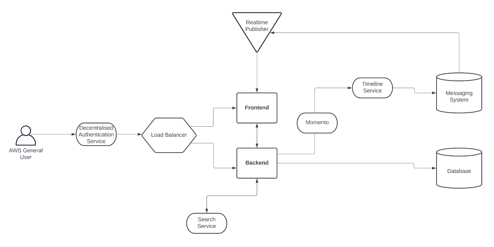
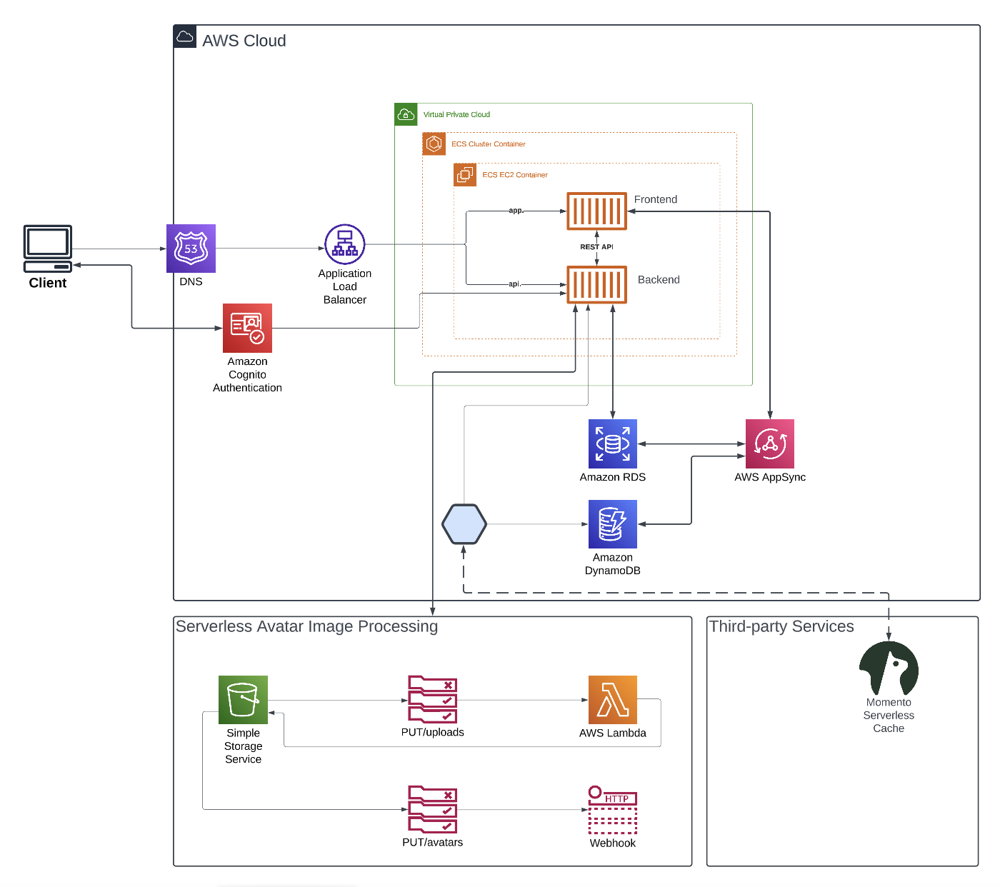
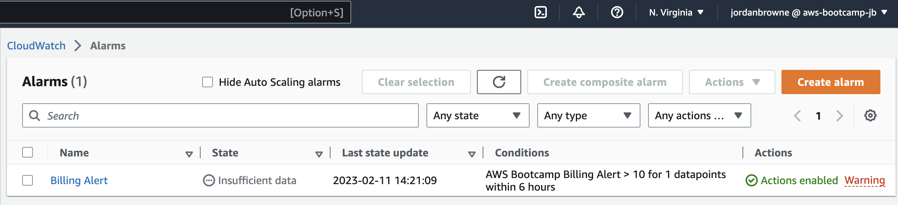
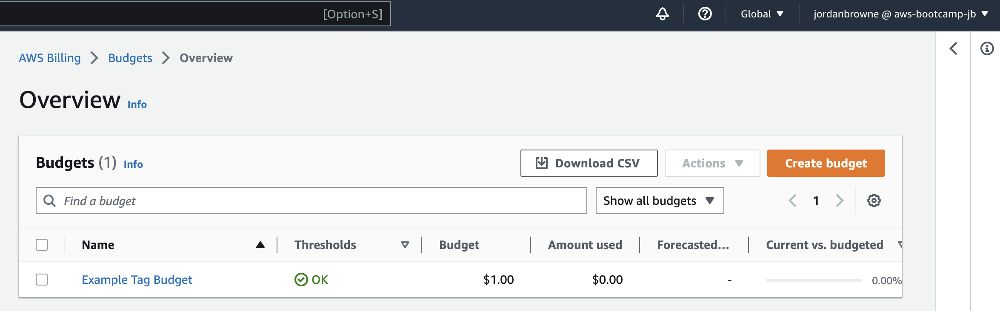
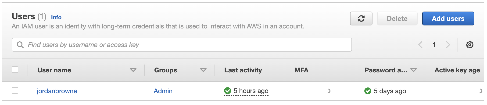
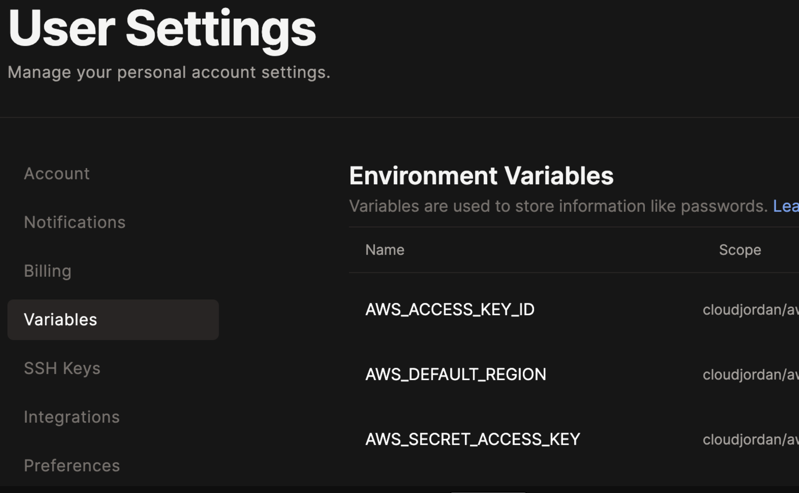

# Week 0 — Billing and Architecture

## Required Homework

### Conceptual Diagram

For the first part of the homework I completed the conceptual diagram based on what was learned in the week 0 video lecture. 

This diagram gives a conceptual overview of how an end user would be connected to the social media platform. 


LINK: https://lucid.app/lucidchart/846115f0-36b3-46ba-8b8c-b64a45c0d407/edit?viewport_loc=-537%2C-453%2C2988%2C1486%2C0_0&invitationId=inv_53e0172b-baf8-4629-9e1c-092ae10463ef



### Architectural Diagram

Next I created the logical architectural diagram. Here I demonstrate how the end user would be connected to the social media platform through AWS. 


LINK: https://lucid.app/lucidchart/d2a2ef28-29fc-4f34-b9d4-1486ce61e5ec/edit?viewport_loc=-1463%2C-272%2C4118%2C2049%2C0_0&invitationId=inv_79a09a68-1011-47af-a2fa-a69b4ca19aeb


### Billing Alerts and Budgets
For billing alerts, I did it using both methods; through the management console AND through AWS CLI. 

#### CloudWatch Alarm
To setup billing alarm in the AWS management console I went to cloudwatch and made sure I was in N.virginia us-east-1.

In the side panel I went to Alarms > In alarm then clicked the Create alarm button. It then opend up a wizard to go through the steps of creating the alarm. Here are the steps I took:

1. Click Select metric then scroll down a bit and select Billing. 
2. Then select Total Estimated Charge
3. Select USD and click Select Metric
4. Give it a recognisable name.
5. Scroll down and select the money threshold you want the alert to trigger at then click Next. 
6. Alarm state trigger should be in Alarm. Create new SNS topic. Give it a name and assign the email endpoint then click Create topic. Scroll down and click Next. 
7. Give the alert a name then click Next. 
8. Confirm your settings, scroll down and click Create alarm. Alarm now created, 


I have included my username alias in the screenshot to prove it is my image. 


#### Budget
AWS Budgets allows me to get alerted when I reach or am near my budget threshold. 

Back in AWS Billing, go to budgets in the left panel and create new Budget. I then took the following.

1. Clicked Create budget
2. Choose your settings. I chose option for zero spend budget. This alerts me to any spend over $0.01
3. Make sure to add your email address and set budget low. When done, click Create budget. 
4. Budget now created. Can take up to 24 hours to populate all your spend data. 

I have included my username alias in the screenshot to prove it is my image. 



### IAM User Account
To create an IAM user I took the following steps. 

1. Opened AWS IAM. And clicked Add users. 
2. Chose the settings. i.e. for password and username and console access then clicked Next.
3. Created a group to add the user to. This helps allows users permissions to access and use different services etc. I will add admin access. 
4. Give it a name and assign it the relevant permission.
5. Click Create user group. Once created check the box to make sure IAM account will be added to the group.
6. Will take you to the summary page to confirm the settings you entered then can click Create. 
7. Showed me the summary page with my credentials. 
8. Account now created. 

Account shows my username to prove this is my image. 


### IAM User Access Keys
To create access keys for my IAM user I took the following steps. 

1. In IAM under Users, selecting the user, then security credentials tab you can create various secrutiy credentials for the user, such as Access Keys, password and MFA.
2. Clicked on Access Keys and selected the option for where the access keys are intended to be used. As will be using them for the CLI, selected that option. 
3. On the next screen can give an optional description for access key then click **Create key**. 
4. Then showed me a page with my access key and secret key. 


### Setting up and using AWS CLI in Gitpod
To install and use AWS CLI in Gitpod, I took the following steps. 

1. Ran the following commands as shown in the aws documentation:
```
curl "https://awscli.amazonaws.com/awscli-exe-linux-x86_64.zip" -o "awscliv2.zip"
unzip awscliv2.zip
sudo ./aws/install
```
2. After installing, confirmed it was installed by running the following: aws --version which showed me the version of aws cli installed. 
```
gitpod /workspace $ aws --version
aws-cli/2.9.23 Python/3.9.11 Linux/5.15.0-47-generic exe/x86_64.ubuntu.20 prompt/off
```
3. To setup environment variables for the AWS user account, used environment variables as demonstrated in the [user guide](https://docs.aws.amazon.com/cli/latest/userguide/cli-configure-envvars.html). Copied these lines into a plain text file in GitPod:
```
export AWS_ACCESS_KEY_ID=""
export AWS_SECRET_ACCESS_KEY=""
export AWS_DEFAULT_REGION=""
```
4. To configure the credentials, I added the access key credentials (I generated earlier for the IAM account) to the environment variables I just created. Including adding a default region. Then copied each line into the terminal. 
```
export AWS_ACCESS_KEY_ID="KEY WENT HERE"
export AWS_SECRET_ACCESS_KEY="KEY WENT HERE"
export AWS_DEFAULT_REGION="REGION WENT HERE"
```

5. Ran the command aws sts get-caller-identity. Which outputted:
```
{
    "UserId": "USER ID SHOWED HERE",
    "Account": "ACCOUNT ID SHOWED HERE",
    "Arn": "AMAZON RESOURCE NAME SHOWED HERE"
}
```

6. To make sure everything I have been doing in GitPod will be saved if closing the window and opening again. Inside the .gitpod.yml template, I added the following task. 
```
tasks:
  - name: aws-cli
    env:
			# environment variable to auto-complete aws cli typing commands on partial mode.
      AWS_CLI_AUTO_PROMPT: on-partial
		# installing the aws cli in our chosen directory
    init: |
      cd /workspace
      curl "https://awscli.amazonaws.com/awscli-exe-linux-x86_64.zip" -o "awscliv2.zip"
      unzip awscliv2.zip
      sudo ./aws/install
      cd $THEIA_WORKSPACE_ROOT
```

7.Next ran the following command in the terminal gp env  followed by each credential. This saves the credentials in a secure place in gitpod so our credentials will be available for use every time we launch GitPod.  
```
gp env AWS_ACCESS_KEY_ID="KEY WENT HERE"
gp env AWS_SECRET_ACCESS_KEY="KEY WENT HERE"
gp env AWS_DEFAULT_REGION="REGION WENT HERE"
```

8. In gitpod user settings, I could then see the environment variables I just made.



9. To commit the changes I just made, while in the workspace directory, I went to the source control panel on the left hand side of window. Entered a message for the change we made, then clicked commit. 

10. A prompt window opened, clicked yes to stage changes. And clicked synch after the commit button changed.
 
11. To confirm the changes have beed committed, went back to my github repo, opened the gitpod.yml file to check. Changes now are commited. 

12. Now everytime I closed down the Gitpod environment and reopened it, AWS CLI will automatically install. 


### AWS Organizations and Service Control Policies

```

```

