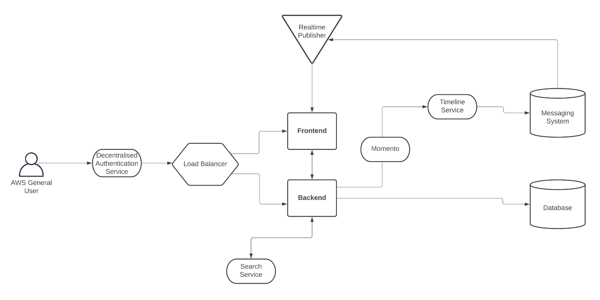

# Week 0 — Billing and Architecture

## Required Homework

### Conceptual Diagram



### Architectural Diagram

### Billing Alerts and Budgets

```

```

### IAM and Account Security

### Setting up and using AWS CLI in Gitpod

```

```

### AWS Organizations and Service Control Policies

```

```

