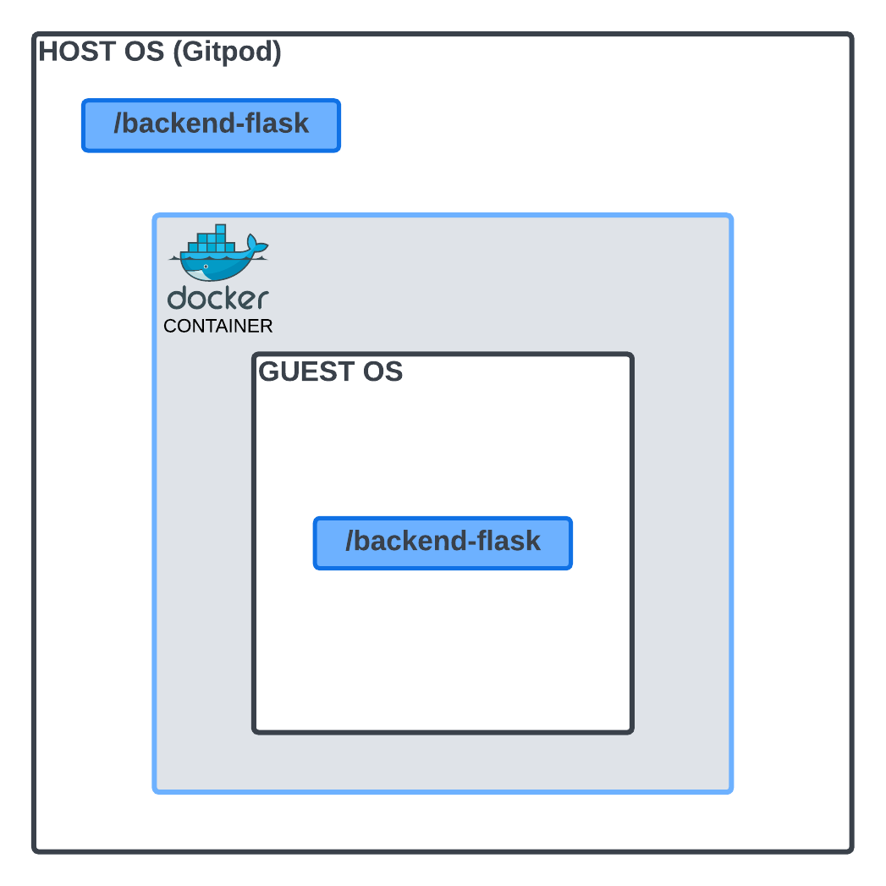
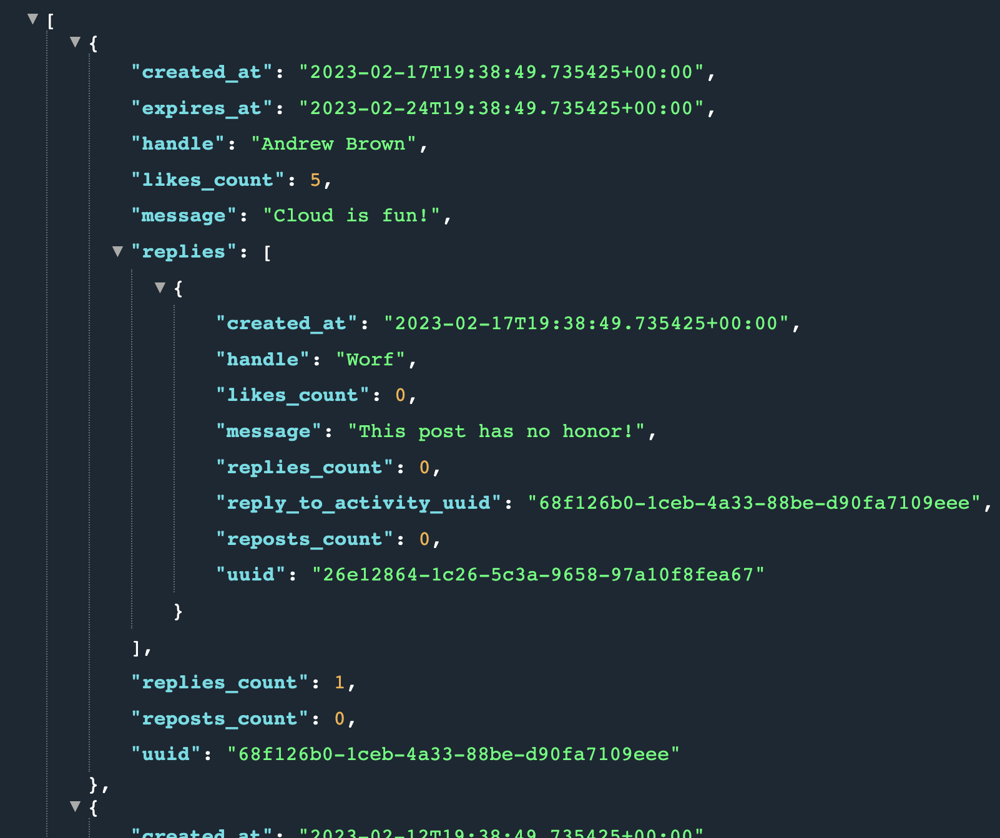
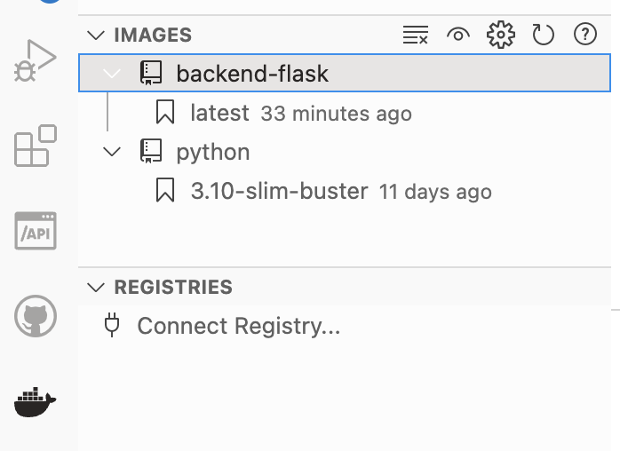
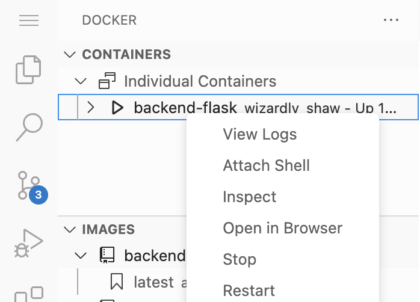
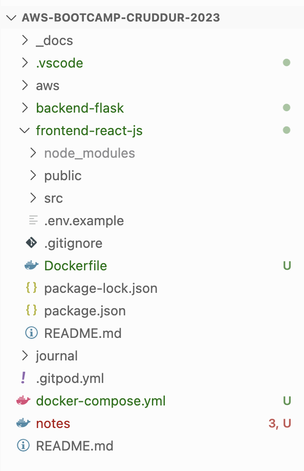
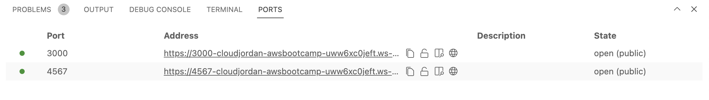
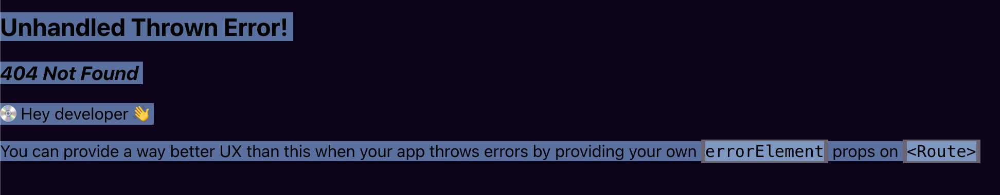
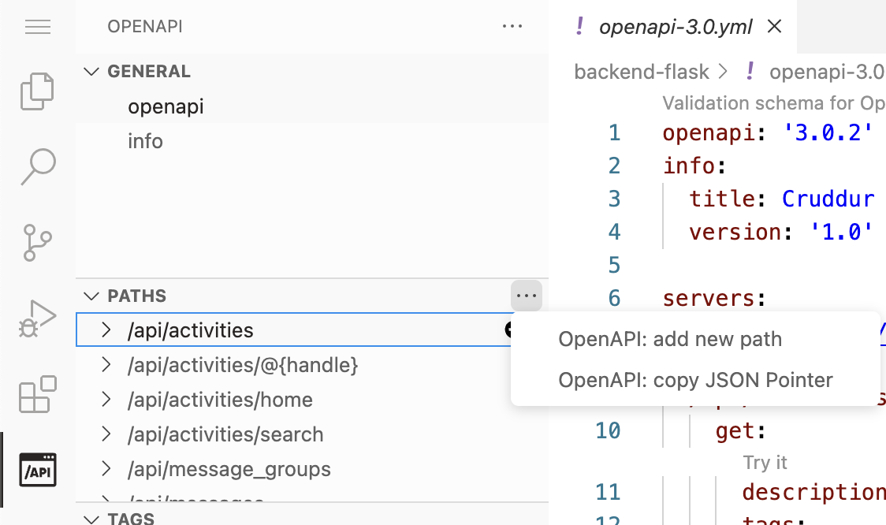
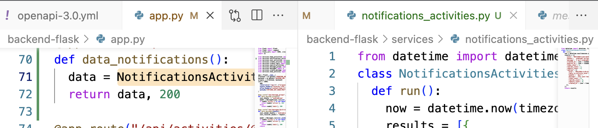
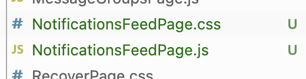

# Week 1 — App Containerization

This week was my first time using containirzation. As something breifly touched on when I was studying for the AWS Cloud Practitioner exam, I was looking forward to getting hands on with this concept using Docker. The tasks I completed for this weeks homeworks are listed in the table below. 

| TASKS COMPLETED |
| :-------------- |
| 1. [Setting Up Docker Containers in the Gitpod Workspace](#docker-containers) |
| 2. [Setting Up The Backend of The Social Media Application](#backend) |
| 3. Setting Up The Frontend of The Social Media Application |
| 4. Troubleshooting |
| 5. Installing DynamoDB and PostgresSQL |
| 6. Container Security Considerations |
| 7. Learning About Cloud Roles |


## 1. Setting Up Docker Containers in the Gitpod Workspace {#docker-containers}


<p>With Docker installed in Gitpod, I created a new `Dockerfile` in the `backend-flask` folder and added the following code to it. <p>
  
<p>This is the set of instructions I am using to build the Docker image. It is a self-contained piece of software that is used to run the image.<p>

<p>This means that anyone can use the image without having to make any changes to it. Regardless of the operating system being used, the Docker image will run:<p>

```
# Use the Python 3.10 slim image as the base
FROM python:3.10-slim-buster

# Set the working directory
WORKDIR /backend-flask

# Copy the dependencies file and install dependencies
COPY requirements.txt requirements.txt
RUN pip3 install -r requirements.txt

# Copy the application code
COPY . .

# Set the Flask environment variable to development
ENV FLASK_ENV=development

# Expose the specified port
EXPOSE ${PORT}

# Start the Flask application
CMD [ "python3", "-m" , "flask", "run", "--host=0.0.0.0", "--port=4567"]

```

I created a diagram in lucid charts which is shown below, to break down what is happening here: 
<br>
- The Gitpod host environment is a virtual machine running Linux.
- The workspace directory `/backend-flask` is located within the Gitpod host environment.
- The Docker container is a sub-environment created within the Gitpod host environment, using the Docker engine installed on the host.
- The guest OS is the operating system running inside the Docker container.
- The Docker container has a duplicate copy of the "/backend-flask" directory from the host environment, mounted as a volume inside the container.
<br>
Link to my Lucid Chart Diagram: https://lucid.app/lucidchart/fa37464f-661f-4279-86d8-bd6aa036a189/edit?viewport_loc=-78%2C-208%2C3196%2C1598%2C0_0&invitationId=inv_9b9bdea1-6c15-4aa6-ba67-c124cdcadb30
<br>
<br>
<p align="center">
  
</p>

<br>

To test the API endpoint, from `/workspace/aws-bootcamp-cruddur-2023`, I navigated to the backend-flask folder. To get it to run, I need to add some temp environment variables for the frontend and backend. I then started the flask application as shown below:

```
# Change directory
cd backend-flask

# Add environment variables
export FRONTEND_URL="*"
export BACKEND_URL="*"

# Run flask
python3 -m flask run --host=0.0.0.0 --port=4567

# Go back to main project directory
cd ..
```

I then unlocked the port to make it public in the "PORTS" tab, then clicked the port URL and added the extension needed `/api/activities/home` and was able to see the JSON data for the backend as show below: 

<p align="center">

</p>

#### Troubleshooting the backend
<p>I ran into issues the first time round where upon opening the port URL I received a "Not Found" error where the URL was not found on the server.<p>

<p>The server was running and accepting requests but they were returning a 404 HTTP status code. This was resolved by adding the temporary environment vairables I mentioned earlier.<p> 
  
<p>Now that it is working, I removed these temporary environment variables using the following command:<p>
  
  ```
unset FRONTEND_URL
unset BACKEND_URL  
  ```
---
#### Container setup for the backend

Back in the main directory `gitpod /workspace/aws-bootcamp-cruddur-2023 (main)` I ran the following code to build the container from the set of instructions I have set in the Dockerfile. This causes Docker to build the image using the set of instructions listed in the Dockerfile:
 
```
  
docker build -t  backend-flask ./backend-flask  
  
```
  
The image has now been created and is vsible under the image section in Gitpod. 

<p align="center">
  
</p>

With the image created, I ran the following command to create a container and run an instance of the image inside of it:

```
docker run --rm -p 4567:4567 -it backend-flask
```

As shown, the container is now created:

<p align="center">
  
</p>


As I will need frontend and backend URL environment variables, I added the following code:
```
set FRONTEND_URL='*'
set BACKEND_URL='*'
docker run --rm -p 4567:4567 -it -e FRONTEND_URL='*' -e BACKEND_URL='*' backend-flask
docker run --rm -p 4567:4567 -it  -e FRONTEND_URL -e BACKEND_URL backend-flask
unset FRONTEND_URL="*"
unset BACKEND_URL="*"
```

Confirmed the container was running by using the `docker ps` command which output the following:
```

CONTAINER ID   IMAGE           COMMAND                  CREATED         STATUS         PORTS                                       NAMES
96f1185b4de8   backend-flask   "python3 -m flask ru…"   9 minutes ago   Up 9 minutes   0.0.0.0:4567->4567/tcp, :::4567->4567/tcp   magical_bouman

```
---
#### Container setup for the frontend

Changed directory into front end directory `cd frontend-react-js/`

```
gitpod /workspace/aws-bootcamp-cruddur-2023/frontend-react-js (main) $
```

Installed node.js packages using: `npm i`. Frontend is using node.js

Once installed, in `frontend-react-js` directory I created a new `Dockerfile` and added the following instructions to it. Similar to how I did before:
```
FROM node:16.18

ENV PORT=3000

COPY . /frontend-react-js

WORKDIR /frontend-react-js

RUN npm install

EXPOSE ${PORT}

CMD ["npm", "start"]
```

---
#### Managing multiple containers with docker-compose 

I created a `docker-compose.yml` file in my root directory. This allows me to define and run multiple Docker containers as a single application.

<p align="center">
  
</p>


As I have a Flask backend and a Node.js frontend, each running in its own Docker container. Instead of manually starting each container with its own docker run command and setting up the necessary network connections and environment variables, I am using a `docker-compose` file:

```
version: "3.8"
services:
  backend-flask:
    environment:
      FRONTEND_URL: "https://3000-${GITPOD_WORKSPACE_ID}.${GITPOD_WORKSPACE_CLUSTER_HOST}"
      BACKEND_URL: "https://4567-${GITPOD_WORKSPACE_ID}.${GITPOD_WORKSPACE_CLUSTER_HOST}"
    build: ./backend-flask
    ports:
      - "4567:4567"
    volumes:
      - ./backend-flask:/backend-flask
  frontend-react-js:
    environment:
      REACT_APP_BACKEND_URL: "https://4567-${GITPOD_WORKSPACE_ID}.${GITPOD_WORKSPACE_CLUSTER_HOST}"
    build: ./frontend-react-js
    ports:
      - "3000:3000"
    volumes:
      - ./frontend-react-js:/frontend-react-js

# the name flag is a hack to change the default prepend folder
# name when outputting the image names
networks: 
  internal-network:
    driver: bridge
    name: cruddur
```

<p>To start the frontend and backend services I have configured in this file, I used the `docker compose up` command. It is doing a docker build and docker run on both the containers I created, while also configuring the environment variables and mounting etc.<p>
  
Now I have ports for the front end code and back end. With both ports unlocked/set to public, I can now view the URLs.  
  
<p align="center">
  
</p>
<br>


## 2. Setting Up The Backend of The Social Media Application{#backend}

After unlocking the port, clicking on the URL assigned to port 3000 opens up the frontend application. After creating user credentials and signing in, I clicked on the "**Notifications**" button in the side panel on the left. This took me to a page showing a 404 HTTP error code. 

<p align="center">
  
</p>

To resolve this, I needed to make some changes to the code and add an api endpoint for the Notifications button. 

<p align="center">
  
</p>

In the `/backend-flask` folder, I opened the openapi-3.0.yml file. I then opened API side panel in Gitpod. In the paths section, clicked the three dots to add new path for our notifications api endpoint. This navigated to the relevant part of the YAML file so I can make the needed changes. 

<p align="center">
  
</p>


Created a new line to add the path name. Changed the path name to api/activities/notifications:

```
# From this
/name:
  get:

# To this
/api/activities/notifications:
  get:
```

This is the code I made changes to:

```
/api/activities/notifications:
    get:
      description: 'Return a feed of activity for everyone I follow'
      tags:
        - activities
      parameters: []
      responses:
        '200':
          description: Returns an array of activies
          content:
            application/json:
              schema:
                type: array
                items:
                  $ref: '#/components/schemas/Activity'
                  
```

I then went back over to the `/backend-flask` folder to define a new endpoint. Inside the folder, I opened the the “app.py” file and added the following function. 

```
@app.route("/api/activities/notifications", methods=['GET'])
def data_notifications():
  data = NotificationActivities.run()
  return data, 200
```

In the /backend-flask/services folder I created a Python file named "notifications_activities". Back in the app.py script, I imported this new file using the following code:

```
from services.notifications_activities import *
```

Breaking the code up into several files like this, makes implementing a micro-services approach easier. As opposed to if all the code was a monolith. 

In the notifications_activities Python file, added the following code:
```
from datetime import datetime, timedelta, timezone

class NotificationsActivities:
  def run():
    now = datetime.now(timezone.utc).astimezone()
```
Now I have matched the name of the class to the name of the value assigned to the data variable created in the “app.py” file for the Notifications function we created earlier as shown below. 

<p align="center">
  
</p>

```
This code enables pulling live data (using the now method from the “datetime” module we imported) from the 
latest activities of the other user accounts we follow on cruddur. 

In “app.py” this notifications file was imported when I used the function: from 
services.notifications_activities import *

Then further down in the code of “app.py” we define a function called data_notifications which has a 
variable that stores the notification function.
```

Next I added the following nested list into the “notifications_activities.py” file in the “run” function:
```
results = [{
      'uuid': '68f126b0-1ceb-4a33-88be-d90fa7109eee',
      'handle':  'midnight eclipse',
      'message': 'I am a midnight unicorn',
      'created_at': (now - timedelta(days=2)).isoformat(),
      'expires_at': (now + timedelta(days=5)).isoformat(),
      'likes_count': 5,
      'replies_count': 1,
      'reposts_count': 0,
      'replies': [{
        'uuid': '26e12864-1c26-5c3a-9658-97a10f8fea67',
        'reply_to_activity_uuid': '68f126b0-1ceb-4a33-88be-d90fa7109eee',
        'handle':  'Worf',
        'message': 'This post has no honor!',
        'likes_count': 0,
        'replies_count': 0,
        'reposts_count': 0,
        'created_at': (now - timedelta(days=2)).isoformat()
      }],   
    }]
```

Then below that, I added the return function to return these results when the notification activities function gets executed:

```
 return results
```

<p>Now when I open up the backend port URL and append the `/api/activities/notifications` Returns the notifications endpoint data.<p>
<br>

## 3. Setting Up The Frontend of The Social Media Application

In the `/frontend-react-js` folder, I opened up the app.js file and imported the following. As this imported file doesn't exist yet it's currently greyed out:
```
import NotificationsFeedPage from './pages/NotificationsFeedPage';
```

Added the following code to the `const router = createBrowserRouter` that takes an array as it's argument. 

```
{
    path: "/notifications",
    element: <NotificationsFeedPage />
},
```

```
A router object is used to define the different paths and components that will be rendered when a user navigates to a certain URL in the application.

The createBrowserRouter function takes an array of route objects as its argument, where each route object specifies a URL path and the React component that should be rendered when the user navigates to that path.
```

In the explorer panel, inside frontend-react-js/src/pages created new javascript files named `NotificationsFeedPage.js` and a new CSS file called `NotificationsFeedPage.css`.

<p align="center">
  
</p>

In the “NotificationsFeedPage.js” file, I added the code required to build the [NotificationsFeedPage.js](../frontend-react-js/src/pages/NotificationsFeedPage.js)

There is a JavaScript file called “DesktopNavigation.js” in the [src/components](../frontend-react-js/src/components/DesktopNavigation.js) folder. Inside it shows that the notifications button in the Cruddur frontend, is already linked correctly.


## 4. Troubleshooting


