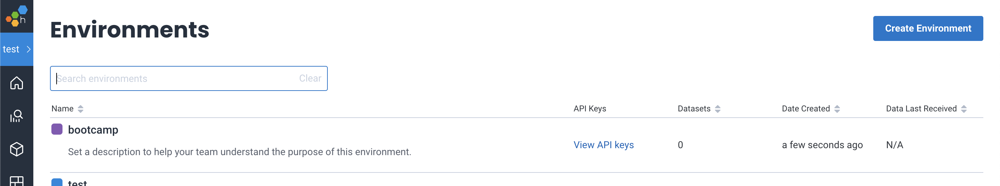
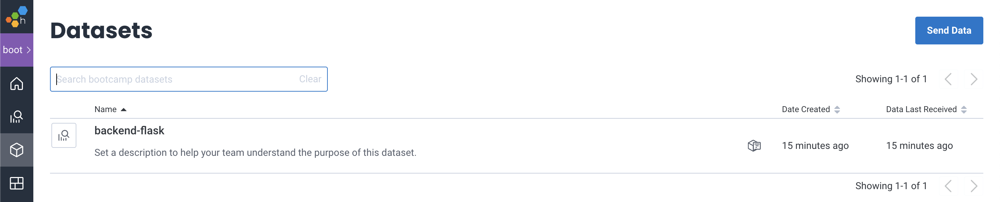
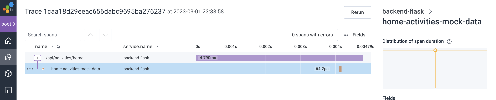
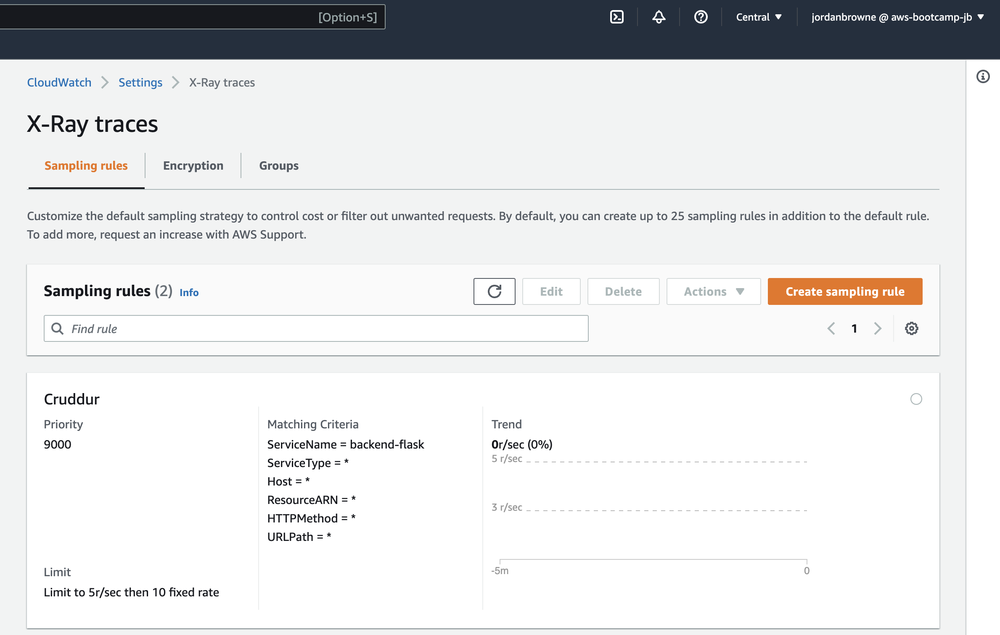
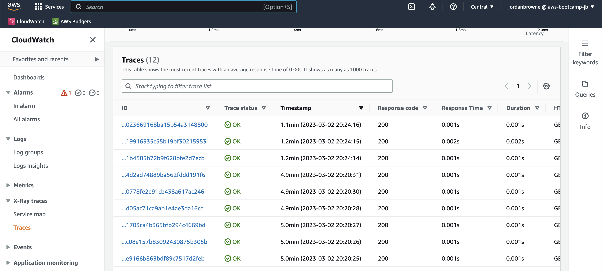
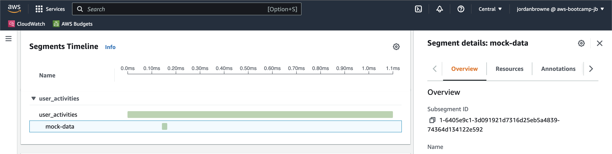
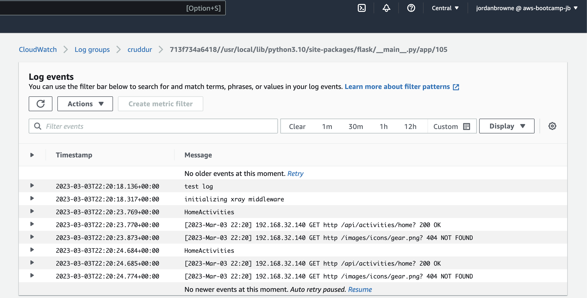
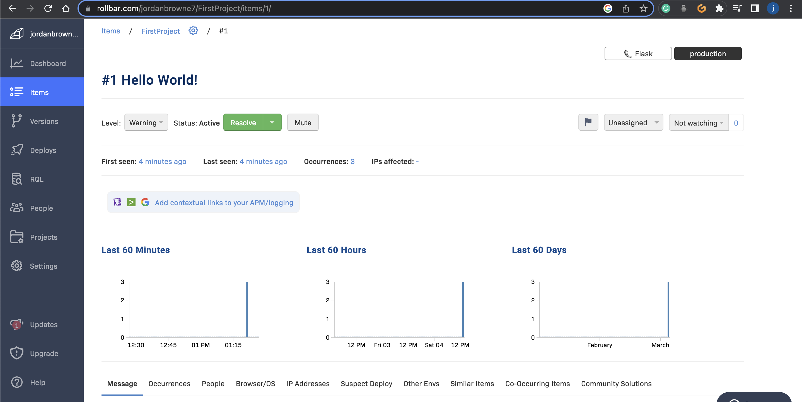

# Week 2 — Distributed Tracing

For week 2 I completed the following tasks:

| TABLE OF CONTENTS |
| :-------------- |
| [What is Distributed Tracing?](#what-is-distributed-tracing) |
| [Setting Up My Environment in Honeycomb](#setting-up-my-environment-in-honeycomb) |
| [Setting Up Honeycomb Environment Variables in Gitpod](#setting-up-honeycomb-environment-variables-in-gitpod) |
| [Instrumenting My Application With Honeycomb](#instrumenting-my-application-with-honeycomb) |
| [Instrumenting My Application With AWS X-Ray](#instrumenting-my-application-with-aws-x-ray) |
| [Sending Application Logs to CloudWatch](#sending-application-logs-to-cloudwatch) |
| [Implementing Rollbar](#implementing-rollbar) |
| [Building Security for Tracing in AWS](#building-security-for-tracing-in-aws) |

 

## What is Distributed Tracing?

From my learning experience, observability is crucial for understanding complex distributed systems. The three pillars of observability, which are metrics, traces, and logs, provide a comprehensive approach to identifying and diagnosing issues.
 
  

Using these observability techniques, I can gain valuable insights into complex distributed systems and identify issues that may not be apparent through other means.

 

## Setting Up My Environment in Honeycomb
  
After creating an environment in my Honeycomb account, I copied it's API key to the clipboard to assign to an environment variable in my Gitpod workspace. 

 

## Setting Up Honeycomb Environment Variables in Gitpod

I saved my Honeycomb API key to a my `HONEYCOMB_API_KEY` environment variable and exported it. I also set the OTEL service name for the OTEL service name environment variable `OTEL_SERVICE_NAME`. This will determine the name Honeycomb uses for my application. I set this in my [docker-compose.yml](../docker-compose.yml) file.
 

I also set the required open telemetry environment variables for reaching the Honeycomb API endpoint and authenticating the sending of telemetry data from my application. These were also added to [docker-compose.yml](../docker-compose.yml).
 
 

## Instrumenting My Application With Honeycomb

To setup instrumentation in my application with Python and Flask, I installed the required dependencies using my [requirements.txt](../backend-flask/requirements.txt) file.
 
 
The next step was to add instrumentation and create and initialize a tracer in my [main](../backend-flask/app.py) flask file. This enabled data to be sent to Honeycomb. To do this I carried out the following steps:

1. Added the imports from Honeycomb to my [app.py](../backend-flask/app.py) file.
2. Added the code required to initialize tracing and an exporter that can send data to Honeycomb.
3. Added the code required to initialize automatic instrumentation with Flask.

 

### ***Confirming the frontend and backend are reachable...***

With dependencies installed for the frontend and backend, I launched my [docker-compose](../docker-compose.yml) environment and opened up the ports to confirm the the frontend and backend were reachable so that Honeycomb could receive the telemtry data. 

### ***Collecting Data in Honeycomb...***

The dataset was automatically created when it arrived with the service name set in docker-compose. 

 

After opening the dataset, I also saw that I was succesful in receiving traces. Following this, I also hardcoded a traced span to mock what a realy one may look like. I did this in my [home_activities](../backend-flask/services/home_activities.py) file. I also experimented with Honeycomb queries, as an alternative way to view data. 

 

## Instrumenting My Application With AWS X-Ray

X-Ray is an observability tool like Honeycomb. It uses a separate container, the X-Ray Daemon, to collect trace data from my application and send it to the X-Ray API for visualization. This ensures that the data collection does not impact the performance of my application
 
  
After installing the [dependencies](../backend-flask/requirements.txt), I instrumented the Flask [app](../backend-flask/app.py) by configuring and enabling the X-Ray middleware to allow it to trace data from my app. 
 
 

### ***Adding X-Ray Sampling Rules Resources...***

I used a JSON [sampling rule](../aws/json/xray.json) to control the volume of trace data generated by my Flask app by specifying conditions for request sampling.

Using AWS CLI I created a X-Ray Traces group in CloudWatch. I also ran the required command to upload my [sampling rule](../aws/json/xray.json) to my newly created group in AWS. 

 

### ***Setting up the X-Ray Daemon...***

I set up the AWS X-Ray daemon in my Flask [app](../backend-flask/app.py). Using [docker-compose](../docker-compose.yml) I added the x-ray-daemon service and configured its environment variables.
 
 
After opening the backend network port and refreshing the page, I saw that the requests were being delivered to the X-Ray Daemon from the shells output. 
 
 
I could also view the traces in AWS CloudWatch X-Ray traces and could view detailed information relating to my traces by clicking on the segment.

 

I also setup a custom subsegment for the [user activities](../backend-flask/services/user_activities.py) page of our web application. 

This was setup by adding the `@xray_recorder.capture('user_activities')` handle to the data_handle function in [app.py](../backend-flask/app.py) to capture a subsegment of the trace for user activities. Also initialzed and created an object from it's class and imported the xray middleware to make it traceable. 

 

## Sending Application Logs to CloudWatch

For CloudWatch log monitoring we used Watchtower. To get started I added the required package to my [dependencies](../backend-flask/requirements.txt) file and installed it. 

I then imported the CloudWatch packages into the Flask [app](../backend-flask/app.py) and cofigured the logger to use CloudWatch. The page I implemented logging for was [home activities](../backend-flask/services/home_activities.py). 
 
 
Finally I added my AWS credentials as environment variables to docker-compose. I confirmed the backend remained reachable by launching the docker compose environment and opening the backend port. Once confirmed, in AWS I could see my log data was now reporting to CloudWatch.  

 

## Implementing Rollbar

For log monitoring and debugging, we also used Rollbar. After adding the required packages to my [dependencies](../backend-flask/requirements.txt) and installing them, I added the `ROLLBAR_ACCESS_TOKEN` to my environment. 

Next, I imported the required packages and added the configuration code to the [app](../backend-flask/app.py). I added a test endpoint to see if code was working as intened. Afterwards, I launched the docker compose environment and opened the ports so we could test getting this test data into Rollbar. I then opened my Rollbar account and could see data was successfully received. 

 

## Building Security for Tracing in AWS

Lastly, I took some notes on how this project could be taken further by implementing security into tracing in AWS. 

### AWS Security Hub with Amazon Event Bridge:

- AWS Security Hub can integrate with Amazon Event Bridge, which allows you to inform Security Hub of events it should take note of for further investigation.
- Note that this integration is with CloudTrail, not CloudWatch.
- AWS Security Hub and Amazon EventBridge for tracing events related to security incidents.

### Security Incident and Event Management (SIEM):

- SIEM can be used to create central observability dashboards with logs and metrics coming in.
- This allows you to manage security incidents and events in a centralized location.

### Event-Driven Architecture with AWS:

- An event-driven architecture can be used to identify potential security issues.
- This can be accomplished using serverless technology.

### Auto-Remediation with Amazon Event Bridge and AWS Security Hub:

- AWS Security Hub and Amazon Event Bridge can be used together for auto-remediation of security issues.

### AWS Services for Threat Detection:

- AWS offers multiple services for threat detection, including Amazon GuardDuty and third-party options.

