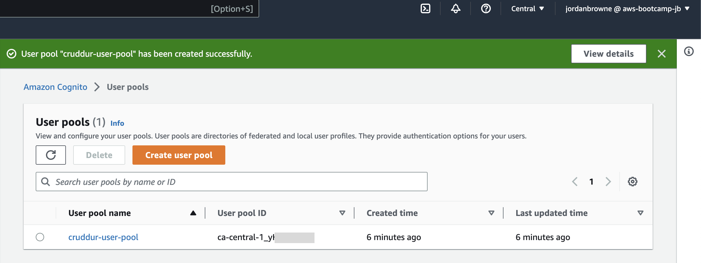
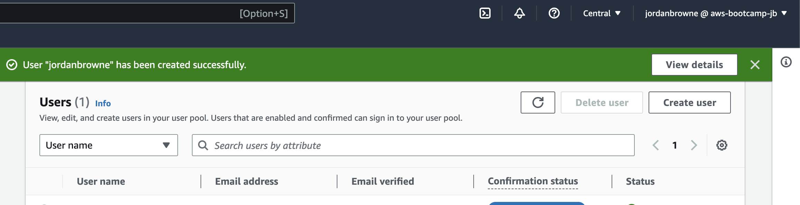

# Week 3 — Decentralized Authentication

For week 3 I completed the following tasks:

| TABLE OF CONTENTS |
| :-------------- |
| [Configuring AWS Cognito](#configuring-aws-cognito) |
| [Configuring AWS Amplify](#configuring-aws-amplify) |
| [Using Access Token with JWT Server Side](#using-access-token-with-jwt-server-side) |

## Configuring AWS Cognito

To configure the web application with login and signup features, we used AWS Cognito user pools. Here are some of the key configuration requirements I made for the account:

- Used email address for username sign in option.
- Enabled self-service so the user can reset their own password if recovery is needed. 
- Disabled Cognito Hosted UI as we are using our web application's UI.
- Enabled pulbic app client to call unauthenticated API operations.

 

## Configuring AWS Amplify

To get started with Amplify, I first added the lirbabry to the list of dependencies in [package.json](../frontend-react-js/package.json) using `npm i aws-amplify --save`. 

Next, I configured the cognito pool in the [frontend app](../frontend-react-js/src/App.js ) by importing the Amplify package and adding the configuration code. The application is using environmental variables from my [docker-compose.yml](../docker-compose.yml) file to configure the behavior of the AWS Amplify library.

### ***Conditionally showing components based on authentication status...***

In [DesktopNavigation.js](../frontend-react-js/src/components/DesktopNavigation.js) and [DesktopSidebar.js](../frontend-react-js/src/components/DesktopSidebar.js), conditional statements are used to display components based on whether the user is logged in or not.
 
 
Inside [HomeFeedPage.js](../frontend-react-js/src/pages/HomeFeedPage.js) I imported the Amplify module, set the state of the user object and used a conditional statement to check whether the user is authenticated. 

`DesktopNavigation.js` displays components like notifications, profile, and message links, while `DesktopSidebar.js` displays trending, suggested, and join links. Different parts of these components are displayed on either side of the feed when the user is logged in to cruddur. 

I also made changes to the [Sign-in](../frontend-react-js/src/pages/SigninPage.js) and [Sign-up](frontend-react-js/src/pages/SignupPage.js) pages so the pages are able to authenticate with Amplify. 
  
Next I created a user in the user pool created earlier and setup Amplify authentication in the following JavaScript files to add the required fuctionality to these pages. This allows for account creation and recovery: 

- [Confirmation Page](../frontend-react-js/src/pages/ConfirmationPage.js) 
- [Recover Page](../frontend-react-js/src/pages/RecoverPage.js) 

 

## Using Access Token with JWT Server Side

In the [Sign-in](../frontend-react-js/src/pages/SigninPage.js) page, I stored the access token during sign-in and used it in a fetch request to the backend. However, the backend initially returned null for the access token until I logged in to my account in the frontend. Once I did this, the access token was fetched correctly.

To validate the access token, I added Flask-AWSCognito as a dependency and created a new Python file called cognito_token_verification.py. I initialized a CognitoJWTToken object in [app.py](../backend-flask/app.py) and added a method to extract the access token from the request headers. I then passed the extracted access token to CognitoJWTToken for verification and handled exceptions in the CognitoTokenVerification class. Once all the necessary code was implemented, I tested the authentication and successfully verified the access token, which was reflected in the debug logs.

